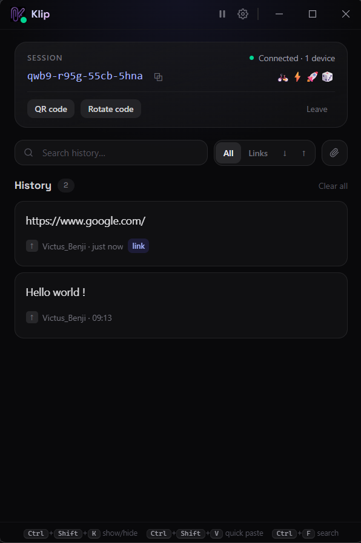
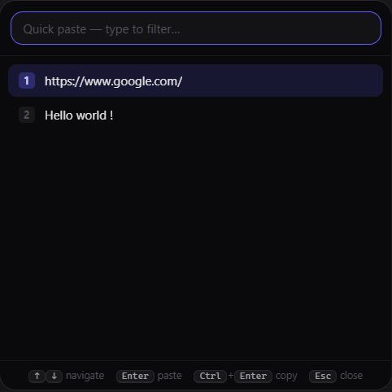

# Klip

[](https://github.com/Benjifilly/klip/actions/workflows/ci.yml)
[](LICENSE)
[](https://www.electronjs.org/)
[](#security-model)

**Instant, end-to-end encrypted clipboard sync between your devices — anywhere in the world.**

Copy on your desktop, paste on your laptop. Klip watches your clipboard, encrypts everything locally with AES-256-GCM, and relays the ciphertext in real time over WebSockets to every device in your session. The relay server never sees your data — only opaque encrypted packets.

<p align="center">
  
  &nbsp;&nbsp;
  
</p>

- ⚡ **Instant** — WebSocket push, no polling a cloud API
- 🔒 **End-to-end encrypted** — AES-256-GCM, key derived on-device with Argon2id; local history is encrypted at rest too
- 🖼️ **Text, links, images & files** — screenshots and files (≤ 20 MB) sync as transparently chunked, individually encrypted packets
- ⌨️ **Quick-paste palette** — `Ctrl+Shift+V` anywhere pops your recent clips at the cursor and pastes straight into the app you were typing in
- 🌍 **Works anywhere** — Wi-Fi, 4G/5G, public networks; all it needs is one outbound WebSocket
- 🪶 **Self-hostable** — the relay is a single tiny Node.js file (one dependency)
- 🖥️ **Lives in your tray** — close the window, sync keeps running

## How it works

```
   Device A                        Relay server                       Device B
┌─────────────┐                ┌─────────────────┐                ┌─────────────┐
│ clipboard   │                │                 │                │ clipboard   │
│   watcher   │   encrypted    │  rooms (Map)    │   encrypted    │  injection  │
│      │      │    packet      │                 │    packet      │      ▲      │
│  AES-256-   │ ─────────────▶ │  roomId ──▶ ws  │ ────────────▶ │  AES-256-   │
│  GCM encrypt│   WebSocket    │  (relay only,   │   WebSocket    │  GCM decrypt│
│             │                │   no plaintext) │                │             │
└─────────────┘                └─────────────────┘                └─────────────┘
```

### Security model

The shared **session code** (e.g. `kx3m-9p2w-7qrt-c4vn`, ~79 bits of entropy) never leaves your devices. Three independent, domain-separated values are derived from it:

| Derivation                                        | Output                  | Who sees it           |
| ------------------------------------------------- | ----------------------- | --------------------- |
| `Argon2id(code, salt="klip/v2/key", 64 MiB, t=3)` | AES-256-GCM session key | **Your devices only** |
| `SHA-256("klip/v2/room:" + code)`                 | 64-char hex room id     | The relay (opaque)    |
| `SHA-256("klip/v2/fingerprint:" + code)`          | 4-emoji fingerprint     | Shown in the UI       |

- Every clipboard packet is `{ iv, ct }` — a fresh 96-bit IV and AES-GCM ciphertext (content + device name + timestamp all encrypted together). Large payloads (images) are split into chunks, each independently encrypted.
- GCM authentication means a tampered packet, or one encrypted with a different code, is silently rejected.
- Argon2id's memory-hardness (64 MiB per guess) makes brute-forcing a code from a room id infeasible, even on GPUs.
- The **session fingerprint** (4 emojis next to the code) is identical on every paired device — a glance confirms you're in the right session.
- **Password managers are respected:** copies tagged with `ExcludeClipboardContentFromMonitorProcessing` / `CanIncludeInClipboardHistory=0` (KeePass, Bitwarden, 1Password…) are never captured — they don't enter the history and never leave the machine.
- **At rest:** settings, history and image blobs are encrypted with the OS keychain (DPAPI on Windows) via Electron `safeStorage` before touching the disk. If the keychain is unavailable, Settings shows a clear warning instead of failing silently.
- **Clipboard hygiene:** optional auto-clear wipes the clipboard N seconds after a copy (Settings), an option keeps received clips out of your clipboard entirely ("history only"), and **Rotate code** moves every connected device to a fresh code in one click.
- **Rotation is consent-based:** a rotation pushed by _another_ device shows who requested it and asks before switching — a peer holding a leaked code can't silently move your devices to a session they control.
- Only machine-generated codes (`xxxx-xxxx-xxxx-xxxx`, ~79 bits) are accepted at join: the room id is a hash of the code, so a weak human-chosen code could be enumerated offline.
- The relay validates shapes, rate-limits, caps payload size, and forwards. It logs nothing about content. Global limits (rooms, members per room, connections per IP, total replay memory) keep one abuser from exhausting it. Its catch-up buffer (see below) holds ciphertext only, in memory, for 2 minutes — disable with `KLIP_REPLAY_MAX=0`.
- The client caps incoming chunked transfers (count and total memory), so a malicious room member can't balloon its memory either.
- The renderer process is fully sandboxed (`contextIsolation`, no Node integration); crypto and networking live in the Electron main process behind a narrow IPC bridge. The page can only send files it received from a real drag-and-drop event — there is no renderer API that takes a filesystem path.
- The client refuses plain `ws://` for anything that isn't localhost or a LAN address — internet relays must be `wss://` so metadata (room id, timing) is protected in transit too.
- The protocol is versioned: every packet carries a `v` field and the relay greets clients with `hello` — future clients (mobile) can evolve the format without breaking old ones.

**Threat model notes:** anyone who learns your session code can join your session — treat it like a password (codes are machine-generated and never reused). Rotation pushes the new code under the _old_ key, so it refreshes a leaked code but does not evict someone who already holds the current key — for that, leave the session and create a fresh one out-of-band (the app reminds you of this next to the Rotate button).

See [SECURITY.md](SECURITY.md) for how to report a vulnerability.

## Repository layout

```
klip/
├── server/                  # Relay server (Node.js + ws, 1 dependency)
│   ├── src/index.js         #   rooms, heartbeat, rate limiting, /healthz
│   └── Dockerfile
├── client/                  # Desktop app (Electron + React + Tailwind v4)
│   ├── electron/
│   │   ├── main.cjs         #   clipboard watcher, WebSocket, tray, IPC
│   │   ├── preload.cjs      #   the only main<->renderer bridge
│   │   └── crypto.cjs       #   E2EE module (isomorphic Web Crypto)
│   ├── src/                 #   React UI (dark dashboard, history, pairing)
│   └── assets/              #   app & tray icons
├── docs/design.md           # design tokens & iOS notes
└── tests/                   # unit (helpers, relay limits) + e2e (crypto, relay)
```

## Getting started

Requires **Node.js ≥ 20**.

```bash
git clone https://github.com/Benjifilly/klip.git
cd klip
npm install        # installs server + client (npm workspaces)
npm test           # e2e: crypto round-trip, GCM auth, room isolation
```

### 1. Start everything

```bash
npm run dev    # relay (:8787) + desktop app, in one command
```

Or separately: `npm run dev:server` and `npm run dev:client` in two terminals.
Vite serves the UI on `127.0.0.1:5173` and Electron opens once it's up — the UI is Electron-only (opening it in a regular browser shows a notice instead).

### 2. Pair and test

1. In the app, click **Create a new session** — a code like `kx3m-9p2w-7qrt-c4vn` is generated and you're connected.
2. On a second device (or a second instance), choose **Join** and enter the same code. The relay URL in Settings must point at the same server (`ws://<your-ip>:8787` on a LAN).
3. Copy any text on one device → it appears in the other device's history and clipboard within a second.

To verify E2EE empirically: watch the relay traffic (e.g. Wireshark on `:8787`) — you'll only ever see base64 `iv`/`ct` blobs.

### 3. Shortcuts & tray

| Shortcut       | Action                                          |
| -------------- | ----------------------------------------------- |
| `Ctrl+Shift+K` | Show / hide the window — works system-wide      |
| `Ctrl+Shift+V` | **Quick-paste palette** at the cursor — global  |
| `Ctrl+F`       | Search the history                              |
| `Ctrl+1` … `9` | Copy the nth visible item back to the clipboard |
| `Ctrl+,`       | Open settings                                   |

The two global shortcuts are configurable in Settings (click the field, press
the new combination); if another app already owns one, Klip tells you instead
of failing silently.

In the palette: type to filter, `↑`/`↓` to navigate, `Enter` **pastes directly** into the app you came from (`Ctrl+Enter` copies without pasting), `Esc` dismisses.

**Files:** copy a file in Explorer (`Ctrl+C`), drop it on the window, or click the 📎 button — it's sent to your devices. Received files stay encrypted in Klip's store until you click **Save** — they are never auto-written to disk, never executed. Limits: 20 MB per file, 3 files per copy, names sanitized on arrival.

**History:** click any item to copy it back to the clipboard (files open the Save dialog instead); hover — or Tab through, everything is keyboard-operable — for Open / Save / Pin / Delete. Filters cover links, images, files, and direction.

**Settings worth knowing:** choose what this device sends (text / images / files), whether received clips land in your clipboard automatically or stay in the history, and an optional system notification when a clip arrives. The session card lists the names of the devices currently connected.

**One-click pairing:** the QR code encodes a `klip://join` link — the desktop app registers the protocol, and joining from a link always asks for confirmation first.

Closing the window doesn't quit: Klip keeps syncing from the **system tray** (the `^` overflow area next to the clock). The tray menu shows the sync status, your five most recent clips for one-click re-copy, the quick-paste palette, and a **Pause sync** toggle. Pin a clip (📌 on hover) and it survives **Clear all** and history pruning.

## Production

### Deploy the relay

The relay is stateless — run it anywhere:

```bash
# Docker
docker build -t klip-relay ./server
docker run -p 8787:8787 klip-relay
```

For internet exposure, terminate TLS in front (Caddy, nginx, or a PaaS like Fly.io/Render that gives you `wss://` for free), then set the relay URL in the app's Settings to `wss://relay.yourdomain.com`.

```nginx
# nginx WebSocket proxy
location / {
    proxy_pass http://127.0.0.1:8787;
    proxy_http_version 1.1;
    proxy_set_header Upgrade $http_upgrade;
    proxy_set_header Connection "upgrade";
    proxy_read_timeout 120s;
}
```

`GET /healthz` returns `{"ok":true,"rooms":N}` for liveness probes, and `GET /metrics` exposes Prometheus counters (rooms, connections, forwarded/replayed packets, replay memory) — never payload content.

Abuse limits are tunable via environment variables (defaults in parentheses):
`KLIP_MAX_ROOMS` (512), `KLIP_MAX_ROOM_MEMBERS` (10), `KLIP_MAX_CONNS_PER_IP` (32),
`KLIP_REPLAY_GLOBAL_MAX_BYTES` (64 MB), plus the replay knobs above. Behind a
reverse proxy, set `KLIP_TRUST_PROXY=1` so the per-IP limit applies to the real
client address from `x-forwarded-for` (auto-enabled on Fly.io).

To verify a deployed relay end-to-end (TLS, WebSocket upgrade, room join):

```bash
node tests/ws-probe.cjs wss://your-relay.example.com   # prints "joined" within a second
```

One-click deploys: `server/fly.toml` (Fly.io) and `render.yaml` (Render blueprint) are included; both give you `wss://` out of the box. CI runs `npm test` and the client build on every push (`.github/workflows/ci.yml`).

### Package the desktop app

```bash
npm run dist:client   # NSIS installer in client/release/
```

Installed builds check GitHub releases for updates (electron-updater) — publish
the files `electron-builder` drops in `client/release/` (installer +
`latest.yml`) as release assets and updates flow automatically.

> **Note on code signing:** releases are currently unsigned, so SmartScreen
> will warn on first run. A signing certificate (e.g. Azure Trusted Signing)
> is planned before wide distribution; the auto-update channel is already in
> place so signed builds can roll out as soon as the certificate lands.

## Roadmap

**Features**

- [ ] **Mobile** — the crypto module is isomorphic (Web Crypto + WASM Argon2id) and the protocol is plain JSON over WebSocket, so a companion PWA or React Native app only needs to reimplement the clipboard layer
- [x] Images (chunked, same E2EE envelope) — arbitrary files are next
- [x] Files (chunked, same E2EE envelope; 20 MB cap, sanitized names, saved only on explicit user action)
- [x] Quick-paste palette — global `Ctrl+Shift+V` popup at the cursor, arrow keys + Enter
- [x] Pinned / favorite clips
- [x] Auto-start on login (toggle in Settings)
- [x] QR-code pairing — the session code renders as a `klip://join` QR for the future mobile app
- [x] `klip://` protocol registered on desktop — one-click pairing behind a confirmation dialog
- [x] Connected-device list — encrypted presence announcements show *which* devices are online
- [x] Configurable global shortcuts, with conflict reporting instead of silent failure
- [x] Per-device selective sync (text / images / files) + optional arrival notifications
- [x] Image & file history filters

**Security**

- [x] Local history, settings and image blobs encrypted at rest (Electron `safeStorage` / DPAPI)
- [x] Session fingerprint — 4 emojis derived from the code, identical on every paired device
- [x] Clipboard auto-clear — wipe the clipboard N seconds after a copy (Settings)
- [x] One-click key rotation — pushes a fresh code to every connected device
- [x] Argon2id (64 MiB, t=3) instead of PBKDF2 for key derivation
- [x] Password-manager exclusion formats honored — copied passwords are never captured
- [x] Rotation initiated by another device requires explicit confirmation
- [x] Only machine-generated session codes accepted (no enumerable weak codes)
- [x] "History only" mode — received clips don't touch the clipboard unless asked
- [x] Hardened renderer file channel (drag-and-drop `File` objects only, no raw paths)
- [ ] Code signing for Windows builds (auto-update channel is already wired)

**Backend**

- [x] Store-and-forward — last N _encrypted_ packets per room (2 min TTL) so reconnecting devices catch up; `KLIP_REPLAY_MAX=0` disables
- [x] `/metrics` Prometheus endpoint (rooms, connections, forwarded/replayed counters) — never payload content
- [x] CI (GitHub Actions: lint + `npm audit` + tests + client build), Dependabot, `SECURITY.md`
- [x] One-click deploy manifests (`server/fly.toml`, `render.yaml`)
- [x] Client-side: plain `ws://` is refused for non-local relays — `wss://` everywhere else
- [x] Protocol versioning — `v` on every packet, `hello` greeting from the relay
- [x] Relay abuse limits — rooms, members per room, connections per IP, global replay memory

## Contributing

PRs welcome. Keep the relay dependency-light, never log payload content, and run `npm run lint && npm test` before submitting. Design tokens and UI conventions live in [docs/design.md](docs/design.md).

## License

[MIT](LICENSE)
